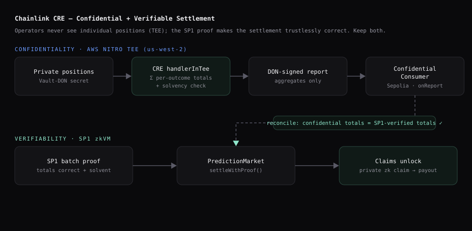
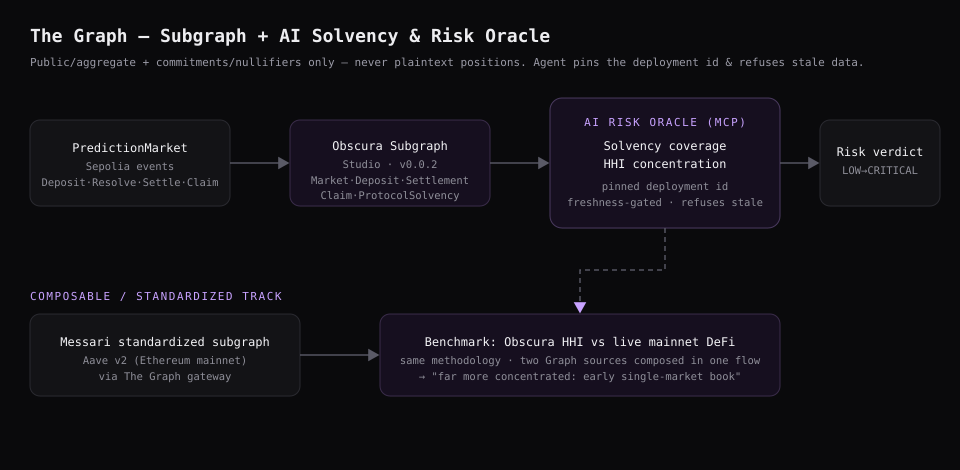
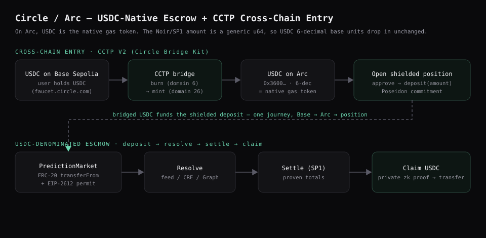

# Obscura Protocol

**Privacy-first prediction markets, settled by proof instead of trust.**

## The idea

Prediction markets today (Polymarket, Kalshi, Augur) make every position
fully public — anyone can see what you bet, which side, and how much. That
leaks strategy and invites front-running on correlated markets.

Obscura Protocol explores what a privacy-first prediction market could look
like:

- **Shielded positions** — a trader's side and stake are hidden behind a
  cryptographic commitment instead of posted in the clear on-chain.
- **Proven, not promised, solvency** — instead of trusting an operator to
  report correct payout totals, a zero-knowledge proof (via the **SP1
  zkVM**) verifies that settlement was computed correctly before any payouts
  unlock.
- **Real oracle resolution** — markets resolve against a live price feed
  (**Chainlink**), not a manual or disputed outcome.
- **Private, unlinkable claims** — winners prove they hold a valid winning
  position and claim their payout without revealing which deposit it came
  from.

## Why this matters

Most "private" prediction-market attempts stop at hiding individual
positions. The harder, largely unsolved problem is proving that the
*aggregate* settlement of a market — or many markets at once — is actually
correct and solvent, without revealing any individual position. That gap is
what this project explores.

## Architecture

Obscura composes three integrations. Each diagram shows the data + proof flow
for one; the "where's the integration" pointers link to the exact code.

### Chainlink CRE — confidential + verifiable settlement

The signature move: node operators sum private positions **inside a TEE** and
cross back only aggregates, while an **SP1 proof** makes the settlement
trustlessly correct on-chain. Confidentiality *and* verifiability — both kept.

> **Where:** `cre-settlement/settlement/workflow.ts` (TEE handler) ·
> `contracts/src/ConfidentialSettlementConsumer.sol` (reconciles vs SP1 totals) ·
> `contracts/src/PredictionMarket.sol` `settleWithProof` · `guest/` + `host/` (SP1).

### The Graph — subgraph + AI solvency/risk oracle

A subgraph indexes only public/aggregate data (never plaintext positions); an
AI risk oracle reasons over it with a **pinned deployment id + freshness gate**,
and benchmarks Obscura against a **Messari-standardized** mainnet subgraph.

> **Where:** `subgraph/` (schema + mappings, Studio v0.0.2) ·
> `agent/src/` (`obscura-risk-oracle` MCP server: solvency + HHI + benchmark).

### Circle / Arc — USDC-native escrow + CCTP cross-chain entry

The escrow is USDC-denominated (ERC-20 + EIP-2612 permit); on Arc, USDC is the
native gas token. Users can bridge USDC **Base → Arc via CCTP** and open a
shielded position in one journey.

> **Where:** `contracts/src/PredictionMarket.sol` (USDC escrow) ·
> `cctp-entry/src/bridge-and-open.ts` (CCTP bridge → deposit) ·
> live on Arc testnet (`contracts/deployments/arc-testnet.json`).

| Layer | Tech |
|---|---|
| Settlement / escrow | Solidity, Foundry (USDC-denominated) |
| Privacy layer | Noir zk circuits — shielded deposits, claims, foresight, parlays, reputation |
| Solvency proof | SP1 zkVM |
| Confidential settlement | Chainlink CRE (TEE) |
| Indexing / risk agent | The Graph subgraph + MCP AI oracle |
| Stablecoin / cross-chain | Circle USDC, Arc, CCTP |
| Client | Next.js, Wagmi, Viem (Sepolia + Arc) |

## Status

Early build — architecture and scaffolding in progress. More as it lands.

## License

MIT
